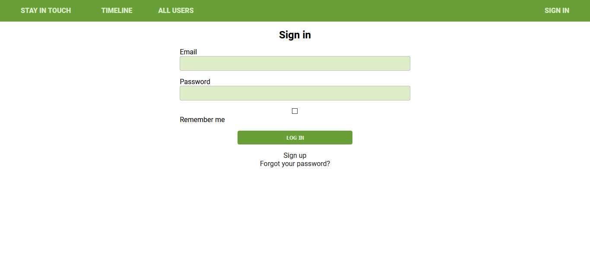
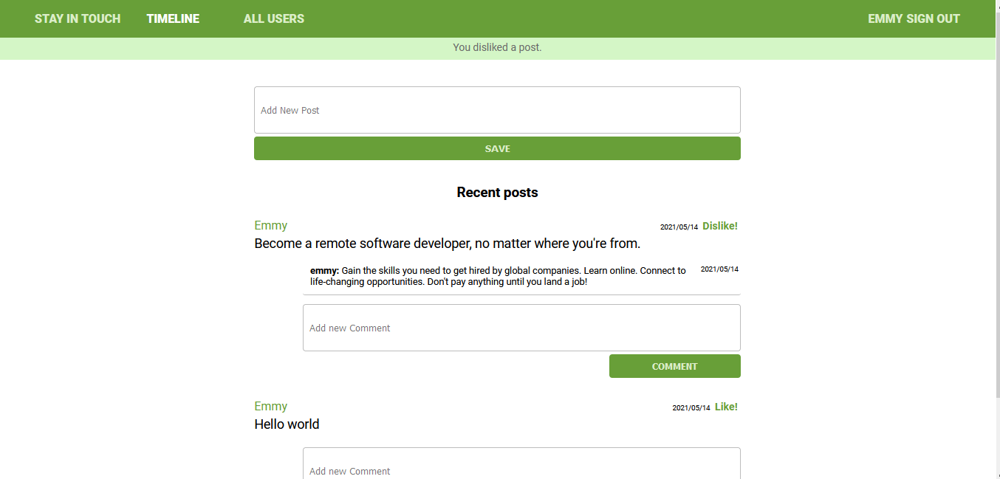
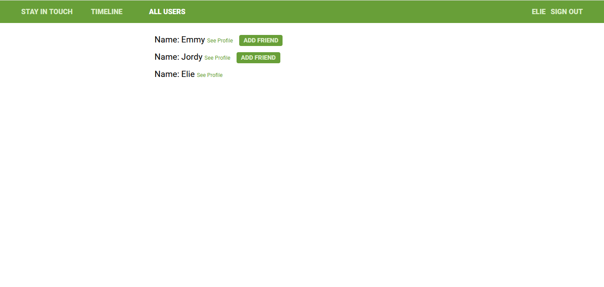
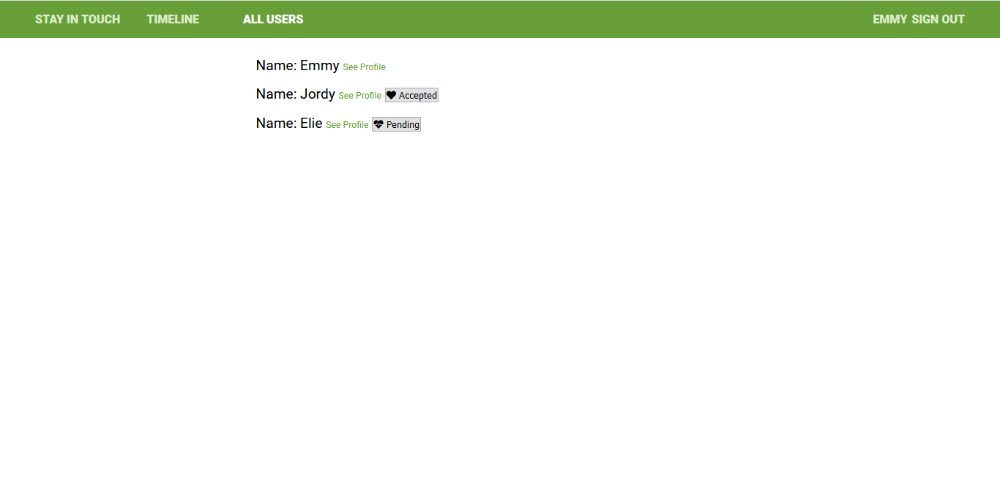
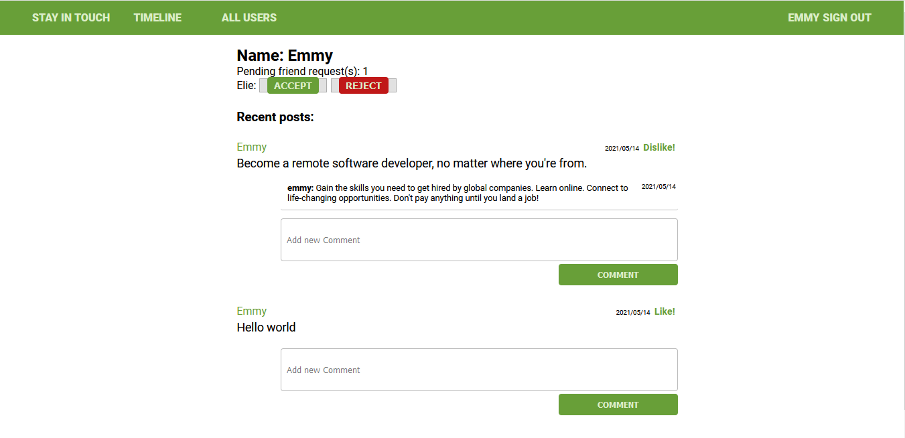
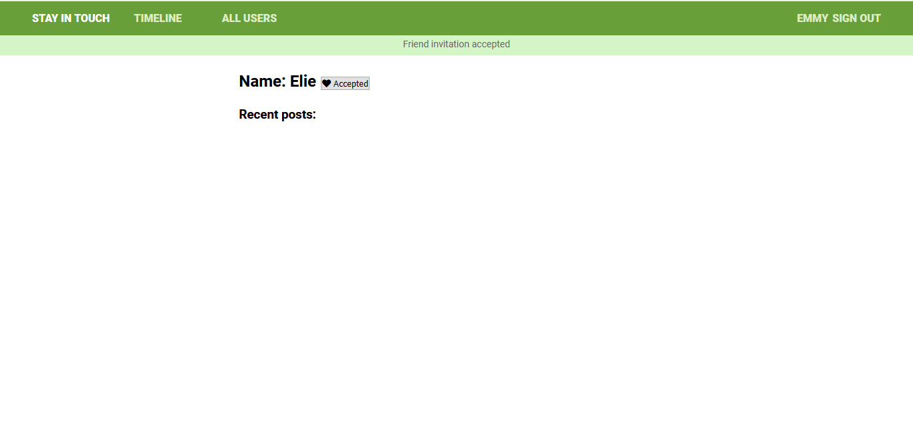
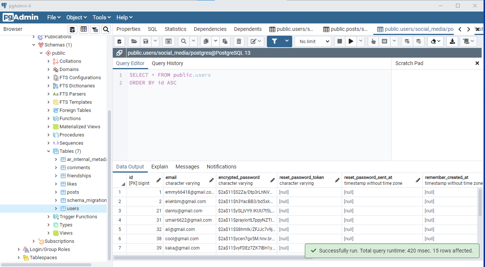

# "Stay in touch" Social Media Website

This social media app allows users to create posts, friend other users and then like and/or comment their posts.


Only signed-in users can have access to the apps features. When Logged-in, a user is able to see a list of all users / to see “Timeline” page with posts (with number of likes and comments) written by him and all his friends (the most recent posts on the top) / to see a selected user page with their user name and all posts written by them (the most recent posts on the top) /  to create new posts (text only) / to like/dislike posts (but can like single post only once) / to add comments to posts / to send friendship invitations / to accept or reject friendships invitation / to see pending friendship invitations sent to him from other users.

# OverView









# Database



## Live Demo


## Here is a description of business requirements for the app:

As a guest user:


    I want to be able to create account/log in.

    I can see only “Sign in” and “Sign out” page.


As a logged-in user:


    I want to be able to see all users list.

    I want to be able to see selected user page with their user name and all posts written by them (the most recent posts on the top).

    I want to be able to send a friendship invitation.

    I want to see a button “Invite to friendship” next to the name of user who is not my friend yet - on both users’ list and single user page.

    I want to be able to see pending friendship invitations sent to me from other users.

    I want to be able to accept or reject friendships invitation.

    I want to be able to create new posts (text only).

    I want to be able to like/dislike posts (but I can like single post only once).

    I want to be able to add comments to posts.

    I want to be able to see “Timeline” page with posts (with number of likes and comments) written by me and all my friends (the most recent posts on the top).

    Timeline page should be the root page of the app.


## Getting Started

To get a local copy up and running follow these simple example steps:


## Built With

* Ruby v2.7.2
* Ruby on Rails v6.1.3.2
* Postgres: >=13.2-2
* SQLite3
* Node.js
* Yarn


### Setup and Install

* Open your terminal - Windows: `Win + R`, then type `cmd` | Mac: `Command + space`, then type `Terminal`
* Navigate to a directory of your choosing using the `cd` command
* Run this command in your OS terminal: `https://github.com/Emmyn5600/Stay-in-touch.git` to get a copy of the project
* Navigate to the project's directory using the `cd` command
* Migrate the database to your environment by running `rails db:migrate`
* Run `rails webpacker:install` to configure Webpacker for your environment. Otherwise, an error like `Webpacker::Manifest::MissingEntryError` will appear if you attempt to run the server.
* Install dependencies by running `bundle install`* Execute `rails server` to fire up the server
* Visit `http://localhost:3000/` in your browser to get into the app
* Interact with the app using the links in the nav bar. To access private pages, sign up by clicking the `Sign Up` link
* Interact with the app
* To close the server, enter `Ctrl + C` in your terminal

### Setup

Instal gems with:

```
bundle install
```

Setup database with:

```
   rails db:create
   rails db:migrate
```

### Github Actions

To make sure the linters' checks using Github Actions work properly, you should follow the next steps:

1. On your recently forked repo, enable the GitHub Actions in the Actions tab.
2. Create the `feature/branch` and push.
3. Start working on your milestone as usual.
4. Open a PR from the `feature/branch` when your work is done.

### Usage

Start server with:

```
    rails server
```

Open `http://localhost:3000/` in your browser.

### Run tests

```
    rpsec --format documentation
    bundle exec rspec
```

> Tests will be added by Microverse students. There are no tests for initial features in order to make sure that students write all tests from scratch.


## Author

👤 **NSABIMANA Emmanuel**

- GitHub: [@emmyn5600](https://github.com/Emmyn5600)
- Twitter: [@NSABIMA62253884](https://twitter.com/NSABIMA62253884)
- LinkedIn: [@nsabimana-emmanuel-4276091b2](https://www.linkedin.com/in/nsabimana-emmanuel-4276091b2/)

## 🤝 Contributing

Contributions, issues and feature requests are welcome!

Feel free to check the [https://github.com/Emmyn5600/Stay-in-touch/actions](issues/).

## Show your support

Give a ⭐️ if you like this project!

## Acknowledgments

* Microverse

